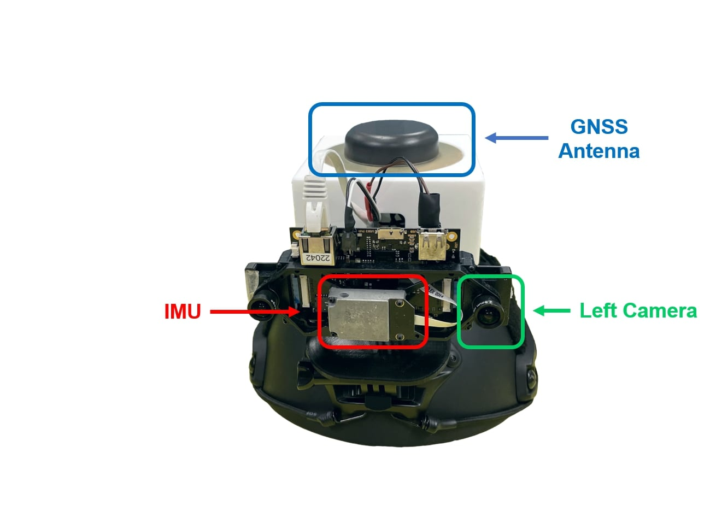
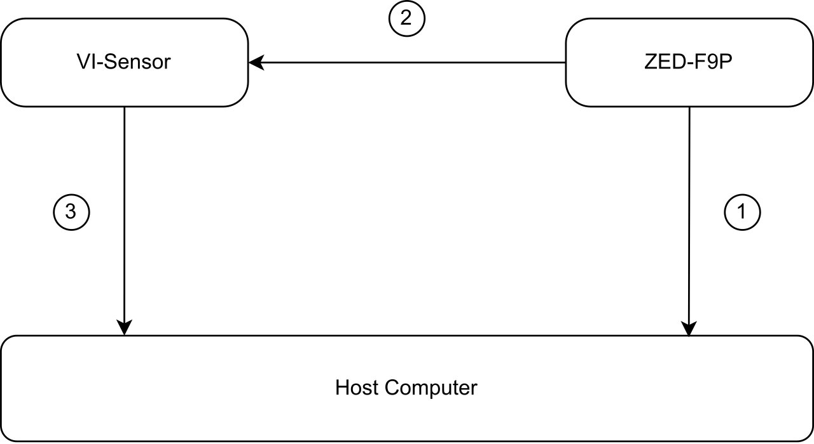

# GVINS-Dataset

Author/Maintainer: CAO Shaozu (shaozu.cao AT gmail.com), LU Xiuyuan (xluaj AT connect.ust.hk), SHEN Shaojie (eeshaojie AT ust.hk)

This repository hosts dataset collected during the development of [GVINS](https://github.com/HKUST-Aerial-Robotics/GVINS). The dataset contains GNSS raw measurement, visual and inertial data which are necessary for GNSS-Visual-Inertial fusion algorithm. 

# 1. Sensor Suit
<p align="center">
  
</p>

### 1.1. VI-Sensor
The visual and inertial data are collected using a [VI-Sensor](http://wiki.ros.org/vi_sensor). The VI-Sensor has two Aptina MT9V034 image sensors, which form a stereo camera together, and a Analog Devices ADIS 16448 IMU. The image and inertial data from the VI-Sensor are well synchronized by hardware design. A detailed spec sheet of this sensor can be found [here](https://github.com/ethz-asl/libvisensor/blob/master/VISensor_Factsheet_web.pdf). The camera and IMU parameters can be found in `GVINS-Dataset/data/visensor_parameters/`.

### 1.2. u-blox ZED-F9P Receiver
We use [u-blox ZED-F9P](https://www.u-blox.com/en/product/zed-f9p-module) to collect GNSS raw measurements and ground truth location. The ZED-F9P owns an internal RTK engine which is capable to provide receiver's location at an accuracy of 1cm in open area. To obtain the RTK solution, a real-time RTCM stream from a 3km away GNSS observation station is fed to the receiver. The GNSS antenna in our platform is a [Tallysman’s TW3882](https://www.tallysman.com/product/tw3882-dual-band-gnss-antenna/).

# 2. Synchronization
The time system between the VI-Sensor and the GNSS receiver is synchronized via Pluse Per Second (PPS) signal. The synchronization process is illustrated in the figure below:

<p align="center">
  
</p>

1. The GNSS receiver reports the time information of next PPS signal. In our system the reporting frequency is set to 1Hz.
2. The PPS signal from the GNSS receiver is used to trigger the external interrupt of VI-Sensor. In our system the frequency of PPS is set to 0.2 Hz.
3. When VI-Sensor is interrupted by the PPS signal, it reports its local time to the host computer.

In this way the host computer knows both the global and local timestamps of the PPS signal so these two time systems get aligned together.


# 3. Dataset Details
The dataset is released in the form of rosbag and currently there are two rosbags available:

| name | duration | size | link | 
| :--: | :------: | :--: | :--: |
| sports_field | 25min | 20.5GB | [OneDrive](https://hkustconnect-my.sharepoint.com/:u:/g/personal/scaoad_connect_ust_hk/Eb5EuCmYR4RBnXbpjV8EfNQBORvT0WPtGXMbwPa4Rmx6Lg?e=SYIHUv) |
| complex_environment | 32min | 26.1GB | [OneDrive](https://hkustconnect-my.sharepoint.com/:u:/g/personal/scaoad_connect_ust_hk/EalZKULm8QFPqNZlf53C31QBmcQ1KUsWnOQ6N2rIefNBYA?e=QUbvHe) |
| urban_driving | 41min | 33.4GB | [OneDrive](https://hkustconnect-my.sharepoint.com/:u:/g/personal/scaoad_connect_ust_hk/EX1pIitB4iFIqXjf2JZ_LYMBbENBrC1Rnl18KQKGeH3T0A?e=eFTp1f) |

The data items within the rosbag are listed below:
| topic | type | frequency | description |
| :---: | :--: | :-------: | :---------: |
| /cam0/image_raw | sensor_msgs/Image | 20Hz | right camera |
| /cam1/image_raw | sensor_msgs/Image | 20Hz | left camera |
| /imu0 | sensor_msgs/Imu | 200Hz | IMU |
| /external_trigger | gvins/LocalSensorExternalTrigger | - | publish when VI-Sensor is trigger. [definition](https://github.com/HKUST-Aerial-Robotics/GVINS/blob/main/estimator/msg/LocalSensorExternalTrigger.msg)
| /ublox_driver/receiver_lla | sensor_msgs/NavSatFix | 10Hz | Receiver's GNSS solution (brief). |
| /ublox_driver/receiver_pvt | gnss_comm/GnssPVTSolnMsg | 10Hz | Receiver's GNSS solution (verbose). [definition](https://github.com/HKUST-Aerial-Robotics/gnss_comm/blob/main/msg/GnssPVTSolnMsg.msg) |
| /ublox_driver/range_meas | gnss_comm/GnssMeasMsg | 10Hz | GNSS raw measurement. [definition](https://github.com/HKUST-Aerial-Robotics/gnss_comm/blob/main/msg/GnssMeasMsg.msg) | 
| /ublox_driver/ephem | gnss_comm/GnssEphemMsg | - | The broadcast ephemeris of GPS, Galileo and BeiDou. [definition](https://github.com/HKUST-Aerial-Robotics/gnss_comm/blob/main/msg/GnssEphemMsg.msg) |
| /ublox_driver/glo_ephem | gnss_comm/GnssGloEphemMsg | - | The broadcast ephemeris of GLONASS. [definition](https://github.com/HKUST-Aerial-Robotics/gnss_comm/blob/main/msg/GnssGloEphemMsg.msg) | 
| /ublox_driver/iono_params | gnss_comm/StampedFloat64Array | - | The broadcast ionospheric parameters. [definition](https://github.com/HKUST-Aerial-Robotics/gnss_comm/blob/main/msg/StampedFloat64Array.msg) | 
| /ublox_driver/time_pulse_info | gnss_comm/GnssTimePulseInfoMsg | 1Hz | The time information of next PPS signal. [definition](https://github.com/HKUST-Aerial-Robotics/gnss_comm/blob/main/msg/GnssTimePulseInfoMsg.msg).

# 4. Toolkit

**The toolkit provided in this package requires [gnss_comm](https://github.com/HKUST-Aerial-Robotics/gnss_comm) library.**
### 4.1. Convert GNSS raw measurement to RINEX File
Many GNSS softwares like RTKLIB accept RINEX file as the input. To convert the GNSS raw measurements in the rosbag to the corresponding RINEX file, firstly clone this repo to your catkin workspace and set `INPUT_BAG_FILEPATH` and `OUTPUT_RINEX_FILEPATH` in `toolkit/src/bag2rinex.cpp`. Then build and run the toolkit with:
```
cd ~/catkin_ws/
catkin_make
source devel/setup.bash
rosrun gvins_dataset_toolkit bag2rinex
```
The observation RINEX file should be generated after a while. The corresponding GNSS ephemeris RINEX file can be found in `GVINS-Dataset/data/ephemeris_rinex/`. 

### 4.2 Save RTK solution to csv file
To extract the RTK solution and status to a local csv file, firstly set `INPUT_BAG_FILEPATH` and `OUTPUT_RTK_FILEPATH` in `toolkit/src/bag2rtk_solution.cpp`.  Then build and run the toolkit with:
```
cd ~/catkin_ws/
catkin_make
source devel/setup.bash
rosrun gvins_dataset_toolkit bag2rtk_solution
```
Each record in the generated csv file is in the form of:
```
gnss_ts_ns, ecef_px, ecef_py, ecef_pz, enu_vx, enu_vy, enu_vz, fix_type, valid_fix, diff_soln, carr_soln
```
, with each item described in the following:
| name | description | 
| :--: | :---------: |
| gnss_ts_ns | GNSS time of the navigation epoch (expressed as Unix timestamp in ns) |
| ecef_p* | The x, y, z component of the position in ECEF frame |
| enu_v* | The x, y, z component of the velocity in ENU frame |
| fix_type | GNSS fix type (0=no fix, 1=dead reckoning only, 2=2D-fix, 3=3D-fix, 4=GNSS+dead reckoning combined, 5=time only fix) |
| valid_fix | if fix valid (1=valid fix) |
| diff_soln | if differential correction were applied (1=applied) |
| carr_soln | carrier phase range solution status (0=no carrier phase, 1=float, 2=fix) |


# 5. License
The dataset is released under [CC-BY-NC-SA-4.0](https://creativecommons.org/licenses/by-nc-sa/4.0/) license.
